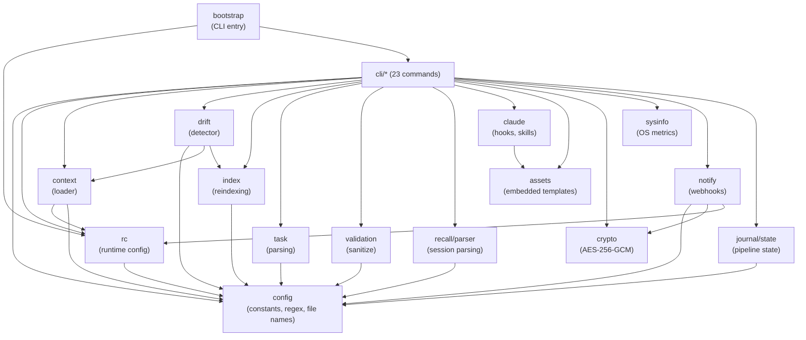

# Architecture

## Overview

ctx is a CLI tool that creates and manages a `.context/` directory
containing structured markdown files. These files provide persistent,
token-budgeted, priority-ordered context for AI coding assistants
across sessions.

Design philosophy:

- **Markdown-centric**: all context is plain markdown; no databases,
  no proprietary formats. Files are human-readable and version-
  controlled alongside the code they describe.
- **Token-budgeted**: context assembly respects configurable token
  limits so AI agents receive the most important information first
  without exceeding their context window.
- **Priority-ordered**: files are loaded in a deliberate sequence
  (rules before tasks, conventions before architecture) so agents
  internalize constraints before acting.
- **Convention over configuration**: sensible defaults with optional
  `.ctxrc` overrides. No config file required to get started.

## Package Dependency Graph

```
                          ┌─────────────┐
                          │  cmd/ctx    │
                          │  main.go    │
                          └──────┬──────┘
                                 │
                          ┌──────▼──────┐
                          │  bootstrap  │
                          │  (root cmd) │
                          └──────┬──────┘
                                 │
           ┌─────────────────────┼─────────────────────┐
           │                     │                     │
    ┌──────▼──────┐       ┌──────▼──────┐       ┌──────▼──────┐
    │   cli/add   │       │  cli/agent  │  ...  │ cli/system  │
    │  cli/drift  │       │  cli/recall │       │  cli/watch  │
    └──────┬──────┘       └──────┬──────┘       └──────┬──────┘
           │                     │                     │
    ┌──────┴─────────────────────┴─────────────────────┘
    │  Shared dependencies (selected per command)
    │
    ├──► context ──► rc ──► config          (leaf)
    ├──► drift ──► context, index, rc
    ├──► index ──► config
    ├──► task ──► config
    ├──► validation ──► config
    ├──► recall/parser ──► config
    ├──► claude ──► assets
    ├──► notify ──► crypto, rc, config
    ├──► journal/state ──► config
    ├──► crypto                             (leaf, stdlib only)
    └──► sysinfo                            (leaf, stdlib only)
```

Foundation packages (`config`, `assets`, `crypto`, `sysinfo`) have
zero internal dependencies. Everything else builds upward from them.

### Dependency Matrix

```
                    config  assets  rc  context  crypto  sysinfo  drift  index  task  validation  recall/parser  claude  notify  journal/state
config                 -
assets                 -      -
rc                     ✓             -
context                ✓             ✓     -
crypto                                           -
sysinfo                                                    -
drift                  ✓             ✓     ✓                        -      ✓
index                  ✓                                                   -
task                   ✓                                                          -
validation             ✓                                                                 -
recall/parser          ✓                                                                            -
claude                        ✓                                                                            -
notify                 ✓             ✓                  ✓                                                          -
journal/state          ✓                                                                                                  -
```

### Mermaid (for renderers that support it)



## Component Map

### Foundation Packages (zero internal dependencies)

| Package           | Purpose                                           | Key Exports                                        |
|-------------------|---------------------------------------------------|----------------------------------------------------|
| `internal/config` | Constants, regex, file names, read order, perms   | `FileReadOrder`, `RegExEntryHeader`, `FileType`    |
| `internal/assets` | Embedded templates via `go:embed`                 | `Template()`, `SkillContent()`, `PluginVersion()`  |
| `internal/crypto` | AES-256-GCM encryption (stdlib only)              | `Encrypt()`, `Decrypt()`, `GenerateKey()`          |
| `internal/sysinfo`| OS metrics with platform build tags               | `Collect()`, `Evaluate()`, `MaxSeverity()`         |

### Core Packages

| Package                  | Purpose                                                | Key Exports                                |
|--------------------------|--------------------------------------------------------|--------------------------------------------|
| `internal/rc`            | Runtime config from `.ctxrc` + env + CLI flags         | `RC()`, `ContextDir()`, `TokenBudget()`    |
| `internal/context`       | Load `.context/` directory with token estimation       | `Load()`, `EstimateTokens()`, `Exists()`   |
| `internal/drift`         | Context quality validation (7 checks)                  | `Detect()`, `Report.Status()`              |
| `internal/index`         | Markdown index tables for DECISIONS/LEARNINGS          | `Update()`, `ParseEntryBlocks()`           |
| `internal/task`          | Task checkbox parsing                                  | `Completed()`, `Pending()`, `SubTask()`    |
| `internal/validation`    | Input sanitization and path boundary checks            | `SanitizeFilename()`, `ValidateBoundary()` |
| `internal/recall/parser` | Session transcript parsing (JSONL + Markdown)          | `ParseFile()`, `FindSessionsForCWD()`      |
| `internal/claude`        | Claude Code integration types and skill access         | `Skills()`, `SkillContent()`               |
| `internal/notify`        | Webhook notifications with encrypted URL storage       | `Send()`, `LoadWebhook()`, `SaveWebhook()` |
| `internal/journal/state` | Journal processing pipeline state (JSON)               | `Load()`, `Save()`, `Mark*()`              |

### Entry Point

| Package              | Purpose                                                    |
|----------------------|------------------------------------------------------------|
| `internal/bootstrap` | Create root Cobra command, register 23 subcommands         |

### CLI Commands (`internal/cli/*`)

| Command        | Purpose                                                                         |
|----------------|---------------------------------------------------------------------------------|
| `add`          | Append entries to context files (decisions, tasks, learnings, conventions)       |
| `agent`        | Generate AI-ready context packets with token budgeting                          |
| `compact`      | Archive completed tasks, clean up context files                                 |
| `complete`     | Mark tasks as done in TASKS.md                                                  |
| `decision`     | Manage DECISIONS.md (reindex)                                                   |
| `drift`        | Detect stale/invalid context and report issues                                  |
| `hook`         | Generate AI tool integration configs (Claude, Cursor, Aider, Copilot, Windsurf) |
| `initialize`   | Create `.context/` directory, deploy templates, merge settings                  |
| `journal`      | Export sessions; generate static site or Obsidian vault                         |
| `learnings`    | Manage LEARNINGS.md (reindex)                                                   |
| `load`         | Output assembled context in priority order                                      |
| `loop`         | Generate Ralph loop scripts for autonomous iteration                            |
| `notify`       | Send fire-and-forget webhook notifications                                      |
| `pad`          | Encrypted scratchpad CRUD with blob support and merge                           |
| `permissions`  | Permission snapshot/restore (golden images) for Claude Code                     |
| `recall`       | Browse, export, lock/unlock AI session history                                  |
| `remind`       | Session-scoped reminders surfaced at start                                      |
| `serve`        | Serve static journal site locally via zensical                                  |
| `status`       | Display context health summary                                                  |
| `sync`         | Reconcile codebase changes with context documentation                           |
| `system`       | System diagnostics, resource monitoring, hook plumbing                          |
| `task`         | Task archival and snapshots                                                     |
| `watch`        | Monitor stdin for context-update tags and apply them                            |

## Data Flow Diagrams

### 1. `ctx init` — Initialization

```
User                     cli/initialize           assets           Filesystem
 │                            │                     │                  │
 │  ctx init [--minimal]      │                     │                  │
 │ ─────────────────────────► │                     │                  │
 │                            │  Read templates     │                  │
 │                            │ ──────────────────► │                  │
 │                            │  ◄────────────────  │                  │
 │                            │  Template bytes     │                  │
 │                            │                     │                  │
 │                            │  Create .context/                      │
 │                            │ ──────────────────────────────────────►│
 │                            │  Write CONSTITUTION, TASKS, etc.       │
 │                            │ ──────────────────────────────────────►│
 │                            │  Generate AES-256 key                  │
 │                            │ ──────────────────────────────────────►│
 │                            │  Deploy hooks + skills                 │
 │                            │ ──────────────────────────────────────►│
 │                            │  Merge settings.local.json             │
 │                            │ ──────────────────────────────────────►│
 │                            │  Write/merge CLAUDE.md                 │
 │                            │ ──────────────────────────────────────►│
 │  ◄────────────────────────                                          │
 │  "Initialized with N files"│                     │                  │
```

### 2. `ctx agent` — Context Packet Assembly

```
AI Agent              cli/agent              rc              context          FS
  │                      │                   │                  │              │
  │  ctx agent           │                   │                  │              │
  │  --budget 4000       │                   │                  │              │
  │ ───────────────────► │                   │                  │              │
  │                      │  TokenBudget()    │                  │              │
  │                      │ ────────────────► │                  │              │
  │                      │  ◄──────────────  │                  │              │
  │                      │  4000             │                  │              │
  │                      │                   │                  │              │
  │                      │  Load(dir)                           │              │
  │                      │ ──────────────────────────────────►  │              │
  │                      │                                      │  Read .md    │
  │                      │                                      │ ───────────► │
  │                      │                                      │  ◄─────────  │
  │                      │  ◄──────────────────────────────────                │
  │                      │  Context{files, tokens}              │              │
  │                      │                                      │              │
  │                      │  Score entries by                    │              │
  │                      │  recency + relevance                │              │
  │                      │  ┌──────────────┐                   │              │
  │                      │  │ Sort by score│                   │              │
  │                      │  │ Fit to budget│                   │              │
  │                      │  │ Overflow →   │                   │              │
  │                      │  │ "Also Noted" │                   │              │
  │                      │  └──────────────┘                   │              │
  │  ◄──────────────────                                       │              │
  │  Markdown packet     │                   │                  │              │
```

### 3. `ctx drift` — Drift Detection

```
User              cli/drift            context           drift.Detect           FS
  │                  │                    │                    │                  │
  │  ctx drift       │                    │                    │                  │
  │ ───────────────► │                    │                    │                  │
  │                  │  Load(dir)         │                    │                  │
  │                  │ ─────────────────► │                    │                  │
  │                  │  ◄───────────────  │                    │                  │
  │                  │  Context           │                    │                  │
  │                  │                    │                    │                  │
  │                  │  Detect(ctx)                            │                  │
  │                  │ ──────────────────────────────────────► │                  │
  │                  │                                         │ checkPathRefs   │
  │                  │                                         │ ──────────────► │
  │                  │                                         │ checkStaleness  │
  │                  │                                         │ checkConstitution
  │                  │                                         │ checkRequired   │
  │                  │                                         │ checkFileAge    │
  │                  │                                         │ checkEntryCount │
  │                  │                                         │ checkMissingPkgs│
  │                  │  ◄──────────────────────────────────────                  │
  │                  │  Report{warnings, violations}           │                  │
  │  ◄──────────────                                           │                  │
  │  Formatted report│                    │                    │                  │
```

### 4. `ctx recall export` — Session Export Pipeline

```
User           cli/recall        recall/parser        journal/state          FS
  │                │                    │                    │                 │
  │  ctx recall    │                    │                    │                 │
  │  export --all  │                    │                    │                 │
  │ ─────────────► │                    │                    │                 │
  │                │  FindSessionsFor   │                    │                 │
  │                │  CWD(cwd)          │                    │                 │
  │                │ ─────────────────► │                    │                 │
  │                │                    │  Scan              │                 │
  │                │                    │  ~/.claude/        │                 │
  │                │                    │  projects/         │                 │
  │                │                    │ ──────────────────────────────────►  │
  │                │                    │  ◄────────────────────────────────   │
  │                │                    │  Parse JSONL       │                 │
  │                │  ◄─────────────────                     │                 │
  │                │  []Session          │                    │                 │
  │                │                    │                    │                 │
  │                │  Load(journalDir)                       │                 │
  │                │ ──────────────────────────────────────► │                 │
  │                │  ◄──────────────────────────────────────                  │
  │                │  JournalState       │                    │                 │
  │                │                    │                    │                 │
  │                │  Plan: new/regen/skip/locked             │                 │
  │                │  Format as Markdown                      │                 │
  │                │  Write to .context/journal/              │                 │
  │                │ ──────────────────────────────────────────────────────────►│
  │                │  MarkExported()                          │                 │
  │                │ ──────────────────────────────────────► │                 │
  │  ◄────────────                                           │                 │
  │  "Exported N"  │                    │                    │                 │
```

### 5. Hook Lifecycle (Claude Code Plugin)

```
Claude Code                  ctx system                  .context/
     │                            │                          │
     │  ─── UserPromptSubmit ───  │                          │
     │  check-context-size        │                          │
     │ ─────────────────────────► │  Read/increment counter  │
     │                            │ ────────────────────────►│
     │  ◄─────────────────────────                           │
     │  (checkpoint msg or silent)│                          │
     │                            │                          │
     │  check-ceremonies          │                          │
     │ ─────────────────────────► │                          │
     │  ◄─────────────────────────                           │
     │  (nudge or silent)         │                          │
     │                            │                          │
     │  check-persistence         │                          │
     │ ─────────────────────────► │  Verify .context/ exists │
     │  ◄─────────────────────────                           │
     │                            │                          │
     │  ─── PreToolUse(Bash) ───  │                          │
     │  block-non-path-ctx        │                          │
     │ ─────────────────────────► │  Check tool invocation   │
     │  ◄─────────────────────────                           │
     │  BLOCK/ALLOW JSON          │                          │
     │                            │                          │
     │  ─── PreToolUse(Edit) ───  │                          │
     │  qa-reminder               │                          │
     │ ─────────────────────────► │                          │
     │  ◄─────────────────────────                           │
     │  (reminder or silent)      │                          │
     │                            │                          │
     │  ─── PostToolUse(Bash) ──  │                          │
     │  post-commit               │                          │
     │ ─────────────────────────► │  Detect git commit       │
     │  ◄─────────────────────────                           │
     │  (nudge or silent)         │                          │
     │                            │                          │
     │  ─── SessionEnd ─────────  │                          │
     │  cleanup-tmp               │                          │
     │ ─────────────────────────► │  Remove stale tmp files  │
     │  ◄─────────────────────────                           │
```

## State Diagrams

### Context File Lifecycle

```
                     ┌──────────────┐
                     │   Project    │
                     │   Created    │
                     └──────┬───────┘
                            │ ctx init
                            ▼
                     ┌──────────────┐
                     │  Populated   │
                     │  (templates) │
                     └──────┬───────┘
                            │ ctx add / manual edits
                            ▼
                ┌───────────────────────┐
                │                       │
           ┌────┤       Active          ├────┐
           │    │  (entries growing)    │    │
           │    └───────────┬───────────┘    │
           │                │                │
    ctx add │         drift detected         │ ctx compact
    ctx complete            │                │ ctx consolidate
           │                ▼                │
           │    ┌───────────────────┐        │
           │    │      Stale        │        │
           │    │  (drift warnings) │        │
           │    └───────────┬───────┘        │
           │                │                │
           └────────────────┘                │
                                             ▼
                                 ┌───────────────────┐
                                 │     Archived       │
                                 │ .context/archive/  │
                                 └───────────────────┘
```

### Task State Machine

```
                  ┌────────────┐
                  │  Pending   │  - [ ] task text
                  │            │
                  └─────┬──────┘
                        │
              ┌─────────┼──────────┐
              │         │          │
              ▼         ▼          ▼
     ┌────────────┐  ┌─────┐  ┌────────┐
     │ In-Progress│  │Done │  │Skipped │
     │ #in-progress│  │[x]  │  │[-]     │
     └─────┬──────┘  └──┬──┘  └────────┘
           │             │
           │             ▼
           │     ┌──────────────┐
           │     │  Archivable  │
           │     │  (no pending │
           └────►│   children)  │
                 └──────┬───────┘
                        │ ctx task archive
                        ▼
                 ┌──────────────┐
                 │  Archived    │
                 │  .context/   │
                 │  archive/    │
                 └──────────────┘
```

### Journal Processing Pipeline

```
  ┌──────────┐     ┌──────────┐     ┌────────────┐     ┌──────────┐     ┌────────┐
  │          │     │          │     │            │     │  Fences  │     │        │
  │ Exported ├────►│ Enriched ├────►│ Normalized ├────►│ Verified ├────►│ Locked │
  │          │     │          │     │            │     │          │     │        │
  └──────────┘     └──────────┘     └────────────┘     └──────────┘     └────────┘
       │                │                 │                  │               │
   recall           enrich            normalize          verify           lock
   export          (YAML front-     (soft-wrap,       (fence balance)   (prevent
   (JSONL→MD)       matter, tags)    clean JSON)                        overwrite)

  Each stage tracked in .context/journal/.state.json as YYYY-MM-DD dates.
  Stages are idempotent. Re-running a stage updates the date.
  Locked entries are skipped by export --regenerate.
```

### Scratchpad Encryption Flow

```
  ┌─────────┐     ┌──────────────┐     ┌──────────────┐
  │  User   │     │  ctx pad     │     │  .context/   │
  │  Input  │     │  (CLI)       │     │  Filesystem  │
  └────┬────┘     └──────┬───────┘     └──────┬───────┘
       │                 │                     │
       │  ctx pad add    │                     │
       │  "secret text"  │                     │
       │ ──────────────► │                     │
       │                 │  LoadKey()          │
       │                 │ ──────────────────► │
       │                 │  ◄──────────────── │
       │                 │  32-byte key        │
       │                 │                     │
       │                 │  Decrypt existing   │
       │                 │  scratchpad.enc     │
       │                 │ ──────────────────► │
       │                 │  ◄──────────────── │
       │                 │  Existing entries   │
       │                 │                     │
       │                 │  Append entry       │
       │                 │                     │
       │                 │  Encrypt all        │
       │                 │  ┌───────────────┐  │
       │                 │  │ AES-256-GCM   │  │
       │                 │  │ random nonce   │  │
       │                 │  │ [12B nonce]    │  │
       │                 │  │ [ciphertext]   │  │
       │                 │  │ [16B auth tag] │  │
       │                 │  └───────────────┘  │
       │                 │                     │
       │                 │  Write .enc         │
       │                 │ ──────────────────► │
       │  ◄────────────  │                     │
       │  "Entry added"  │                     │
```

### Configuration Resolution Chain

```
  Highest priority                              Lowest priority
  ┌─────────────┐   ┌───────────────┐   ┌──────────┐   ┌──────────┐
  │  CLI flags  │ > │ Environment   │ > │  .ctxrc  │ > │ Defaults │
  │ --context-  │   │ CTX_DIR       │   │  (YAML)  │   │ in rc.go │
  │   dir       │   │ CTX_TOKEN_    │   │          │   │          │
  │ --no-color  │   │   BUDGET      │   │          │   │          │
  └─────────────┘   └───────────────┘   └──────────┘   └──────────┘
        │                   │                 │               │
        └───────────────────┴────────┬────────┴───────────────┘
                                     │
                              ┌──────▼──────┐
                              │  internal/  │
                              │  rc.RC()    │
                              │  (singleton)│
                              │  sync.Once  │
                              └─────────────┘
```

## Security Architecture

### Defense Layers

```
  ┌─────────────────────────────────────────────────────────┐
  │                    Layer 5: Plugin Hooks                  │
  │  block-non-path-ctx: reject ./ctx or /abs/path/ctx      │
  │  qa-reminder: gate before commit                         │
  ├─────────────────────────────────────────────────────────┤
  │                    Layer 4: Permission Deny List          │
  │  Bash(sudo *), Bash(rm -rf *), Bash(curl *),            │
  │  Bash(wget *), Bash(go install *), force push            │
  ├─────────────────────────────────────────────────────────┤
  │                    Layer 3: Boundary Validation           │
  │  ValidateBoundary(): resolved .context/ must be under    │
  │  project root (prevents path traversal)                  │
  ├─────────────────────────────────────────────────────────┤
  │                    Layer 2: Symlink Rejection             │
  │  CheckSymlinks(): .context/ dir and children must not    │
  │  be symlinks (M-2 defense against link attacks)          │
  ├─────────────────────────────────────────────────────────┤
  │                    Layer 1: File Permissions              │
  │  Keys: 0600 (owner rw)                                   │
  │  Executables: 0755                                       │
  │  Regular files: 0644                                     │
  ├─────────────────────────────────────────────────────────┤
  │                    Layer 0: Encryption                    │
  │  AES-256-GCM for scratchpad and webhook URLs             │
  │  12-byte random nonce + 16-byte auth tag                 │
  └─────────────────────────────────────────────────────────┘
```

### Secret Detection (Drift Check)

```
  drift.Detect() scans for files matching:
    .env, credentials*, *secret*, *api_key*, *password*

  Exceptions (not flagged):
    *.example, *.sample, files with template markers

  Constitution invariants:
    Never commit secrets, tokens, API keys, or credentials
    Never store customer/user data in context files
```

## Key Architectural Patterns

### Priority-Based File Ordering

Files load in a deliberate sequence defined by `config.FileReadOrder`:

1. CONSTITUTION (rules the agent must not violate)
2. TASKS (what to work on now)
3. CONVENTIONS (how to write code)
4. ARCHITECTURE (system structure)
5. DECISIONS (why things are this way)
6. LEARNINGS (gotchas and tips)
7. GLOSSARY (domain terms)
8. AGENT_PLAYBOOK (how to use this system)

Overridable via `priority_order` in `.ctxrc`.

### Token Budgeting

Token estimation uses a 4-characters-per-token heuristic
(see the context package). When the total context exceeds the
budget (default 8000, configurable via `CTX_TOKEN_BUDGET` or
`.ctxrc`), lower-priority files are truncated or omitted.
Higher-priority files always get included first.

### Structured Entry Headers

Decisions and learnings use timestamped headers for chronological
ordering and index generation:

```
## [2026-01-28-143022] Use PostgreSQL for primary database
```

The regex `config.RegExEntryHeader` parses these across the codebase.

### Runtime Config Hierarchy

Configuration resolution (highest priority wins):

1. CLI flags (`--context-dir`)
2. Environment variables (`CTX_DIR`, `CTX_TOKEN_BUDGET`)
3. `.ctxrc` file (YAML)
4. Hardcoded defaults in `internal/rc`

Managed by `internal/rc` with sync.Once singleton caching.

### Extensible Session Parsing

`internal/recall/parser` defines a `SessionParser` interface. Each
AI tool (Claude Code, potentially Aider, Cursor) registers its own
parser. Currently only Claude Code JSONL is implemented.
Session matching uses git remote URLs, relative paths, and exact
CWD matching.

### Template and Live Skill Dual-Deployment

Skills exist in two locations:

- **Templates** (`internal/assets/claude/skills/`): embedded in the
  binary, deployed on `ctx init`
- **Live** (`.claude/skills/`): project-local copies that the user
  and agent can edit

`ctx init` deploys templates to live. The `/update-docs` skill
checks for drift between them.

### Hook Architecture

The Claude Code plugin uses four lifecycle hooks defined in
`internal/assets/claude/hooks/hooks.json`:

```
  UserPromptSubmit (9 checks)          PreToolUse
  ┌────────────────────────────┐      ┌────────────────────┐
  │ check-context-size         │      │ Bash: block-non-   │
  │ check-ceremonies           │      │   path-ctx         │
  │ check-persistence          │      │ Edit: qa-reminder  │
  │ check-journal              │      │ .*: ctx agent      │
  │ check-reminders            │      │   (cooldown)       │
  │ check-version              │      └────────────────────┘
  │ check-resources            │
  │ check-knowledge            │      PostToolUse
  │ check-map-staleness        │      ┌────────────────────┐
  └────────────────────────────┘      │ Bash: post-commit  │
                                      └────────────────────┘
  SessionEnd
  ┌────────────────────┐
  │ cleanup-tmp        │
  └────────────────────┘
```

Hooks execute synchronously. Failures are softened with `|| true`
where appropriate to prevent cascading session blocks.

## External Dependencies

```
  go.mod (3 direct dependencies):
  ┌──────────────────────────────────────────────────────┐
  │  github.com/fatih/color     — terminal coloring      │
  │  github.com/spf13/cobra     — CLI framework          │
  │  gopkg.in/yaml.v3           — YAML parsing           │
  └──────────────────────────────────────────────────────┘

  External tools (optional, not Go dependencies):
  ┌──────────────────────────────────────────────────────┐
  │  zensical    — static site generation (journal, docs)│
  │  gpg         — commit signing                        │
  └──────────────────────────────────────────────────────┘
```

## Build & Release Pipeline

```
  Developer workstation             GitHub Actions
  ┌──────────────────────┐         ┌──────────────────────┐
  │ make build           │         │ ci.yml               │
  │   CGO_ENABLED=0      │         │   go build           │
  │   -ldflags version   │         │   go test -v ./...   │
  │                      │         │   go vet             │
  │ make audit           │         │   golangci-lint      │
  │   gofmt              │         │   DCO check (PRs)    │
  │   go vet             │         │                      │
  │   golangci-lint      │         │ release.yml          │
  │   lint-drift.sh      │         │   (on v* tag)        │
  │   lint-docs.sh       │         │   test + build-all   │
  │   go test ./...      │         │   6 platform binaries│
  │                      │         │   GitHub release     │
  │ make smoke           │         └──────────────────────┘
  │   Integration tests  │
  │                      │
  │ hack/release.sh      │
  │   VERSION bump       │
  │   release notes      │
  │   plugin version sync│
  │   test + smoke       │
  │   build-all          │
  │   signed git tag     │
  └──────────────────────┘

  Build targets: darwin/amd64, darwin/arm64,
                 linux/amd64, linux/arm64,
                 windows/amd64, windows/arm64
```

## File Layout

```
ctx/
├── cmd/ctx/                     # Main entry point (main.go)
├── internal/
│   ├── bootstrap/               # CLI initialization, command registration
│   ├── claude/                  # Claude Code hooks, skills, settings types
│   ├── cli/                     # 23 command packages
│   │   ├── add/                 #   ctx add
│   │   ├── agent/               #   ctx agent
│   │   ├── compact/             #   ctx compact
│   │   ├── complete/            #   ctx complete
│   │   ├── decision/            #   ctx decision
│   │   ├── drift/               #   ctx drift
│   │   ├── hook/                #   ctx hook
│   │   ├── initialize/          #   ctx init
│   │   ├── journal/             #   ctx journal
│   │   ├── learnings/           #   ctx learnings
│   │   ├── load/                #   ctx load
│   │   ├── loop/                #   ctx loop
│   │   ├── notify/              #   ctx notify
│   │   ├── pad/                 #   ctx pad
│   │   ├── permissions/         #   ctx permissions
│   │   ├── recall/              #   ctx recall
│   │   ├── remind/              #   ctx remind
│   │   ├── serve/               #   ctx serve
│   │   ├── status/              #   ctx status
│   │   ├── sync/                #   ctx sync
│   │   ├── system/              #   ctx system
│   │   ├── task/                #   ctx task
│   │   └── watch/               #   ctx watch
│   ├── config/                  # Constants, regex, file names, read order
│   ├── context/                 # Context loading, token estimation
│   ├── crypto/                  # AES-256-GCM encryption, key management
│   ├── drift/                   # Drift detection engine (7 checks)
│   ├── index/                   # Index table generation for DECISIONS/LEARNINGS
│   ├── journal/
│   │   └── state/               # Journal processing pipeline state
│   ├── notify/                  # Webhook notifications, encrypted URL storage
│   ├── rc/                      # Runtime config (.ctxrc, env, CLI flags)
│   ├── recall/
│   │   └── parser/              # Session transcript parsing (JSONL, Markdown)
│   ├── sysinfo/                 # OS resource metrics (memory, disk, load)
│   ├── task/                    # Task checkbox parsing
│   ├── assets/                  # Embedded templates (go:embed)
│   │   ├── claude/
│   │   │   ├── .claude-plugin/  #   Plugin manifest (plugin.json)
│   │   │   ├── hooks/           #   Hook definitions (hooks.json)
│   │   │   └── skills/          #   30 skill templates (*/SKILL.md)
│   │   ├── entry-templates/     #   Decision/learning entry templates
│   │   ├── ralph/               #   Ralph autonomous loop PROMPT.md
│   │   └── tools/               #   Helper scripts (cleanup, watch)
│   └── validation/              # Input sanitization, path boundary checks
├── docs/                        # Documentation site source
├── site/                        # Generated static site (zensical)
├── hack/                        # Build/release scripts, runbooks
├── editors/vscode/              # VS Code extension (@ctx chat participant)
├── specs/                       # Feature specifications
├── .context/                    # This project's own context directory
│   ├── CONSTITUTION.md          #   Inviolable rules
│   ├── TASKS.md                 #   Current work items
│   ├── CONVENTIONS.md           #   Code patterns and standards
│   ├── ARCHITECTURE.md          #   This file
│   ├── DECISIONS.md             #   Architectural decisions
│   ├── LEARNINGS.md             #   Gotchas and tips
│   ├── GLOSSARY.md              #   Domain terms
│   ├── DETAILED_DESIGN.md       #   Deep per-module reference
│   ├── AGENT_PLAYBOOK.md        #   Meta instructions for AI agents
│   ├── journal/                 #   Exported session transcripts
│   ├── sessions/                #   Session snapshots
│   └── archive/                 #   Archived tasks
├── .claude/                     # Claude Code integration
│   ├── settings.local.json      #   Hooks and permissions
│   └── skills/                  #   Live skill definitions (30 skills)
├── .claude-plugin/              # Plugin marketplace manifest
├── Makefile                     # Build, test, lint, release targets
├── VERSION                      # Single source of truth (0.7.0)
└── go.mod                       # Go 1.25.6, 3 direct dependencies
```
