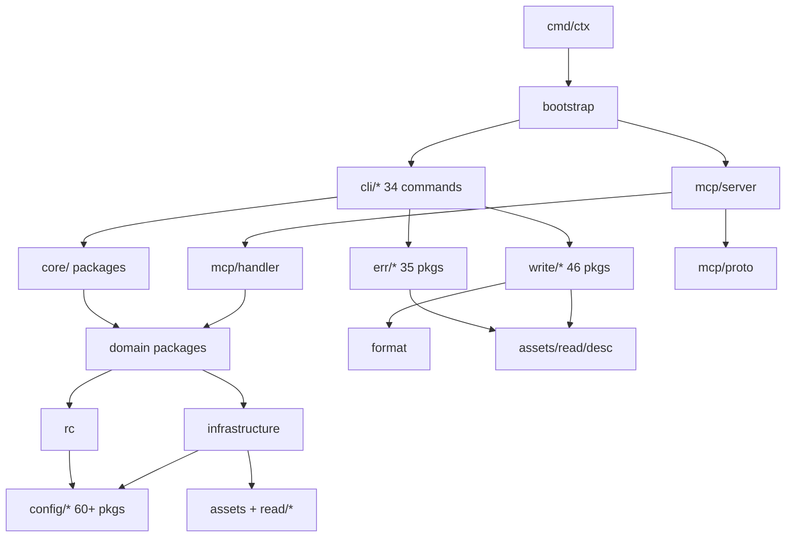

# Architecture

<!--
UPDATE WHEN:
- New components or services are added
- Components are removed or merged
- Data flow between components changes
- External dependencies or integrations change
- Deployment topology changes

DO NOT UPDATE FOR:
- Internal implementation details (use code comments)
- Minor refactoring that doesn't change boundaries
- Bug fixes within existing components

TIP: `ctx drift` scans this file for backtick-enclosed paths
and warns if they do not exist on disk. Keep paths accurate.
-->

## Overview

ctx is a CLI tool that creates and manages a `.context/` directory
containing structured markdown files. These files provide persistent,
token-budgeted, priority-ordered context for AI coding assistants
across sessions. An MCP server exposes the same capabilities to any
MCP-compatible agent over JSON-RPC 2.0.

Design philosophy:

- **Markdown-centric**: all context is plain markdown; no databases,
  no proprietary formats. Files are human-readable and version-
  controlled alongside the code they describe.
- **Token-budgeted**: context assembly respects configurable token
  limits so AI agents receive the most important information first
  without exceeding their context window.
- **Priority-ordered**: files are loaded in a deliberate sequence
  (rules before tasks, conventions before architecture) so agents
  internalize constraints before acting.
- **Convention over configuration**: sensible defaults with optional
  `.ctxrc` overrides. No config file required to get started.
- **Agent-agnostic**: the MCP server speaks standard protocol; the
  CLI works from any shell. No agent-specific coupling in core code.

For per-module deep dives (types, exported API, data flow, edge
cases), see [DETAILED_DESIGN.md](DETAILED_DESIGN.md).

## Layered Architecture

The codebase is organized into strict dependency layers. Each layer
may only import from layers below it.

```
Layer 6: Entry Points
  cmd/ctx, bootstrap (34 commands registered)

Layer 5: CLI Commands + MCP Server
  internal/cli/* (34 cmd/core packages)
  internal/mcp/* (JSON-RPC 2.0 server)

Layer 4: Output + Errors
  internal/write/* (46 writer packages)
  internal/err/* (35 error packages)

Layer 3: Domain Logic
  entity, entry, context/*, drift, index, task, tidy,
  trace, journal/*, memory, notify, claude

Layer 2: Infrastructure
  io, format, parse, sanitize, validate, inspect,
  flagbind, exec/*, log/*, crypto, sysinfo, rc

Layer 1: Foundation (zero internal dependencies)
  internal/config/* (60+ sub-packages)
  internal/assets (embedded FS + 14 typed readers)

Layer 0: Quality Gates (test-only)
  internal/audit, internal/compliance
```

## Package Dependency Graph


```mermaid
graph TD
    CMD[cmd/ctx] --> BOOT[bootstrap]
    BOOT --> CLI[cli/* 34 commands]
    BOOT --> MCP[mcp/server]

    CLI --> CORE[core/ packages]
    CLI --> WRITE[write/* 46 pkgs]
    CLI --> ERR[err/* 35 pkgs]

    MCP --> HANDLER[mcp/handler]
    MCP --> PROTO[mcp/proto]
    HANDLER --> DOMAIN

    CORE --> DOMAIN[domain packages]
    WRITE --> FMT[format]
    WRITE --> DESC[assets/read/desc]
    ERR --> DESC

    DOMAIN --> INFRA[infrastructure]
    DOMAIN --> RC[rc]

    INFRA --> CONFIG[config/* 60+ pkgs]
    INFRA --> ASSETS[assets + read/*]
    RC --> CONFIG
```

*Full dependency matrix:
[architecture-dia-dependencies.md](architecture-dia-dependencies.md)*

## Component Map

### Foundation (zero internal dependencies)

| Package | Purpose | Key Exports |
|---------|---------|-------------|
| `internal/config/*` | 60+ sub-packages: constants, types, regex, text keys | Domain-specific constants imported granularly |
| `internal/assets` | Embedded templates via `go:embed` | `FS` (single embed) |
| `internal/assets/read/*` | 14 typed accessor packages | `desc.Text()`, `skill.Content()`, `entry.List()` |
| `internal/assets/tpl` | Sprintf-based format templates | Entry, journal, loop, obsidian templates |

### Infrastructure

| Package | Purpose | Key Exports |
|---------|---------|-------------|
| `internal/io` | Guarded file I/O with path validation | `SafeReadFile()`, `SafeWriteFile()`, `SafePost()` |
| `internal/format` | Display formatting (time, bytes, tokens) | `TimeAgo()`, `Bytes()`, `Tokens()`, `Truncate()` |
| `internal/parse` | Text-to-typed-value conversions | `Date()` |
| `internal/sanitize` | Input mutation to conform constraints | `Filename()` |
| `internal/validate` | Path validation and symlink checks | `Boundary()`, `Symlink()` |
| `internal/inspect` | String predicates and position queries | `Contains()`, `StartsWithCtxMarker()` |
| `internal/flagbind` | Cobra flag binding with YAML descriptions | `BoolFlag()`, `StringFlag()`, `IntFlag()` |
| `internal/exec/*` | External command wrappers (5 packages) | `git.Run()`, `dep.GoListPackages()` |
| `internal/log/*` | Event logging + stderr warnings | `event.Append()`, `warn.Warn()` |
| `internal/crypto` | AES-256-GCM encryption (stdlib only) | `Encrypt()`, `Decrypt()`, `GenerateKey()` |
| `internal/sysinfo` | OS metrics with platform build tags | `Collect()`, `Evaluate()` |
| `internal/rc` | Runtime config (.ctxrc + env + flags) | `RC()`, `ContextDir()`, `TokenBudget()` |

### Domain Logic

| Package | Purpose | Key Exports |
|---------|---------|-------------|
| `internal/entity` | Shared domain types (no logic) | `Session`, `Context`, `FileInfo`, `EntryParams` |
| `internal/entry` | Entry validation and writing | `ValidateAndWrite()` |
| `internal/context/*` | Context loading with token counting | `load.Do()`, `token.Estimate()`, `summary.Generate()` |
| `internal/drift` | Context quality validation (7 checks) | `Detect()`, `Report.Status()` |
| `internal/index` | Markdown index tables | `Update()`, `ParseEntryBlocks()` |
| `internal/task` | Task checkbox parsing | `Completed()`, `Pending()`, `SubTask()` |
| `internal/tidy` | Context file maintenance | `CompactResult`, `parseBlockAt()` |
| `internal/trace` | Commit-to-context linking | `Collect()`, `FormatTrailer()` |
| `internal/journal/parser` | Session transcript parsing (4 formats) | `ParseFile()`, `FindSessionsForCWD()` |
| `internal/journal/state` | Journal pipeline state (JSON) | `Load()`, `Save()`, `Mark*()` |
| `internal/memory` | Memory bridge (MEMORY.md sync) | `DiscoverPath()`, `Sync()`, `SelectContent()` |
| `internal/notify` | Fire-and-forget webhooks | `Send()`, `LoadWebhook()` |
| `internal/claude` | Claude Code integration types | `Skills()`, `SkillContent()` |

### MCP Server (`internal/mcp/*`)

| Package | Purpose |
|---------|---------|
| `mcp/proto` | JSON-RPC 2.0 message types, MCP constants |
| `mcp/server` | Main loop: stdin read, dispatch, stdout write |
| `mcp/server/dispatch` | Method-based request routing |
| `mcp/server/dispatch/poll` | File mtime polling for change notifications |
| `mcp/server/catalog` | URI-to-file resource mapping (9 resources) |
| `mcp/server/route/*` | Handlers: initialize, ping, tool, prompt, resource |
| `mcp/server/def/*` | Tool (11) and prompt (5) definitions |
| `mcp/handler` | Domain logic as free functions taking `*entity.MCPDeps` |
| `entity.MCPSession` | Per-session advisory state (pure data + mutations) |

### CLI Commands (`internal/cli/*`)

34 commands in 8 groups, each following cmd/root + core/ taxonomy:

| Group | Commands |
|-------|----------|
| Getting Started | `initialize`, `status`, `guide` |
| Context | `add`, `load`, `agent`, `sync`, `drift`, `compact` |
| Artifacts | `decision`, `learning`, `task` |
| Sessions | `journal`, `memory`, `remind`, `pad` |
| Runtime | `config`, `permission`, `pause`, `resume` |
| Integration | `setup`, `mcp`, `watch`, `notify`, `loop` |
| Diagnostics | `doctor`, `change`, `dep`, `why`, `trace` |
| Utilities | `reindex` |
| Hidden | `serve`, `site`, `system` (34 hook subcommands) |

### Output Layer

| Package | Purpose |
|---------|---------|
| `internal/write/*` | 46 packages: formatted terminal/JSON output |
| `internal/err/*` | 35 packages: error constructors with YAML text |

### Quality Gates (test-only)

| Package | Purpose |
|---------|---------|
| `internal/audit` | AST-based codebase invariant tests |
| `internal/compliance` | File-level convention adherence tests |

## Data Flow Diagrams

Five core flows define how data moves through the system:

1. **`ctx init`**: User invokes -> `cli/initialize` reads embedded
   templates from `assets` -> creates `.context/` directory -> writes
   all template files -> generates AES-256 key -> deploys hooks and
   skills -> merges `settings.local.json` -> writes/merges `CLAUDE.md`.

2. **`ctx agent`**: Agent invokes with `--budget N` ->
   `context/load.Do()` reads all `.md` files -> entries scored by
   recency and relevance -> sorted and fitted to token budget ->
   overflow entries listed as "Also Noted" -> returns Markdown packet.

3. **`ctx drift`**: User invokes -> `drift.Detect()` runs 7 checks
   (path refs, staleness, constitution compliance, required files,
   file age, entry count, missing packages) -> returns report.

4. **`ctx journal source`**: User invokes with `--all` ->
   `journal/parser` scans `~/.claude/projects/` -> auto-detects
   format (Claude Code JSONL, Copilot, Copilot CLI, Markdown) ->
   loads journal state -> plans each session (new/regen/skip/locked)
   -> formats as Markdown -> writes to `.context/journal/`.

5. **MCP tool call**: Client sends JSON-RPC request over stdin ->
   `server.Serve()` reads and parses -> `dispatch.Do()` routes by
   method -> `handler` executes domain logic -> governance warnings
   appended -> JSON-RPC response written to stdout.

*Full sequence diagrams:
[architecture-dia-data-flows.md](architecture-dia-data-flows.md)*

## State Diagrams

Five state machines govern lifecycle transitions:

1. **Context files**: Created -> Populated (`ctx init`) -> Active
   (entries growing) -> Stale (drift detected) -> Active (fixed)
   or Archived (`ctx compact` to `.context/archive/`).

2. **Tasks**: Pending `[ ]` -> In-Progress (`#in-progress`) / Done
   `[x]` / Skipped `[-]` -> Archivable (no pending children) ->
   Archived (`ctx task archive`).

3. **Journal pipeline**: Imported (source->MD) -> Enriched (YAML
   frontmatter) -> Normalized (soft-wrap, clean JSON) -> Fences
   Verified -> Locked. Tracked in `.state.json`.

4. **MCP session**: Unstarted -> Started (`session_event`) ->
   Context Loaded (`ctx_status`) -> Active (tool calls with
   governance nudges: drift checks, persist reminders).

5. **Config resolution**: CLI flags (highest) > env vars >
   `.ctxrc` (YAML) > hardcoded defaults -> resolved once via
   `rc.RC()` with `sync.Once`.

*Full state machine diagrams:
[architecture-dia-state-machines.md](architecture-dia-state-machines.md)*

## Security Architecture

Six defense layers (innermost to outermost):

- **Layer 0 -- Encryption**: AES-256-GCM for scratchpad and webhook
  URLs; 12-byte random nonce + 16-byte authentication tag.
- **Layer 1 -- File permissions**: Keys 0600, executables 0755,
  regular files 0644.
- **Layer 2 -- Symlink rejection**: `.context/` directory and
  children must not be symlinks (defense against symlink attacks).
- **Layer 3 -- Boundary validation**: `validate.Boundary()` ensures
  resolved paths stay under project root (prevents path traversal).
- **Layer 4 -- Guarded I/O**: All file operations through
  `internal/io/Safe*` functions with prefix rejection.
- **Layer 5 -- Plugin hooks**: `block-non-path-ctx` rejects bare
  `./ctx` invocations; `qa-reminder` gates commits.

*Full defense layer diagram:
[architecture-dia-security.md](architecture-dia-security.md)*

## Key Architectural Patterns

### Layered Package Taxonomy

Every CLI package follows `cmd/root + core/` taxonomy (Decision
2026-03-06). Each feature's `cmd/root/cmd.go` defines the Cobra
command; `cmd/root/run.go` implements the handler. Shared logic
lives in `core/`. Grouping commands use `internal/cli/parent.Cmd()`
factory.

### Config Explosion

`internal/config/` contains 60+ sub-packages of pure constants,
compiled regexes, and text keys with zero internal dependencies.
Packages import granularly: `config/agent`, `config/mcp/tool`,
`config/embed/text`. This eliminates the "god config" anti-pattern
and enables precise dependency tracking.

### Three-Layer Output

Output is separated into three concerns:
1. **`write/*`** (46 packages): formatted messages via `cmd.Println()`
2. **`err/*`** (35 packages): error constructors via `fmt.Errorf()`
3. **`config/embed/text`**: all user-facing strings in YAML

All display text is looked up from embedded YAML, enabling future
i18n without code changes.

### Dual Entry Points

Two ways to access ctx capabilities:
1. **CLI** (`cmd/ctx` -> `bootstrap` -> 34 commands): human and
   script interface
2. **MCP** (`mcp serve` -> JSON-RPC server): agent-native interface
   exposing 11 tools, 9 resources, 5 prompts over stdin/stdout

Both share the same domain packages; neither has privileged access.

### Extensible Session Parsing

`internal/journal/parser` supports 4 session formats: Claude Code
JSONL, Copilot, Copilot CLI, and Markdown. New parsers register via
the `SessionParser` interface. Session matching uses git remote URLs
and CWD paths.

### Token Budgeting

Token estimation uses a 4-characters-per-token heuristic (conservative
overestimate). Both CLI and MCP respect the budget (default 8000,
configurable via `CTX_TOKEN_BUDGET` or `.ctxrc`). Higher-priority
files always included first.

## External Dependencies

Two direct Go dependencies: `spf13/cobra` (CLI framework),
`gopkg.in/yaml.v3` (YAML parsing). Optional external tools:
`zensical` (static site generation) and `gpg` (commit signing).

## Build and Release Pipeline

Local: `make build` (CGO_ENABLED=0, ldflags version), `make audit`
(gofmt, go vet, golangci-lint, lint scripts, tests), `make smoke`
(integration tests). Release: `hack/release.sh` bumps VERSION,
generates release notes, builds all targets, creates signed git tag.
CI: GitHub Actions on push; release on `v*` tags producing 6
platform binaries (darwin/linux/windows x amd64/arm64).

*Full build pipeline diagram:
[architecture-dia-build.md](architecture-dia-build.md)*

## File Layout

```
cmd/ctx/              Entry point (main.go)
internal/
  config/             60+ constant sub-packages
  assets/             Embedded FS + 14 typed readers
  io/                 Guarded file I/O
  format/             Display formatting
  parse/              Text parsing
  sanitize/           Input sanitization
  validate/           Path validation
  inspect/            String predicates
  flagbind/           Flag registration
  exec/               Command wrappers (git, dep, gio, sysinfo, zensical)
  log/                Event log + warn sink
  crypto/             AES-256-GCM encryption
  sysinfo/            OS metrics
  rc/                 Runtime config resolution
  entity/             Shared domain types
  entry/              Entry validation + writing
  context/            Context loading (load, resolve, sanitize, summary, token, validate)
  drift/              Context quality checks
  index/              Markdown index tables
  task/               Task checkbox parsing
  tidy/               Context file maintenance
  trace/              Commit context linking
  journal/            Session parsing (parser/) + pipeline state (state/)
  memory/             MEMORY.md bridge
  notify/             Webhook notifications
  claude/             Claude Code integration
  mcp/                MCP server (proto, handler, server/*, session)
  cli/                34 command packages (cmd/root + core/ each)
  write/              46 output formatting packages
  err/                35 error constructor packages
  bootstrap/          Root command + 34 registrations
  audit/              AST-based invariant tests
  compliance/         Convention adherence tests
docs/                 Site source (blog, cli, reference, security)
hack/                 Build scripts + runbooks
editors/vscode/       VS Code extension
specs/                Feature specifications
.context/             Project context directory
.claude/              Claude Code settings + 30 live skills
```
