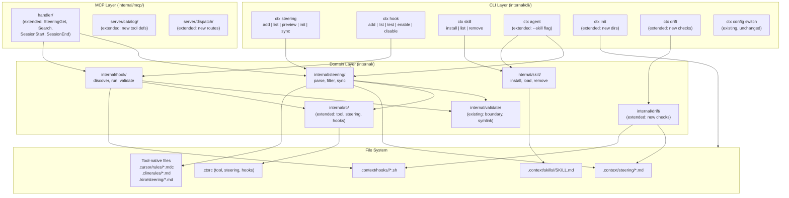
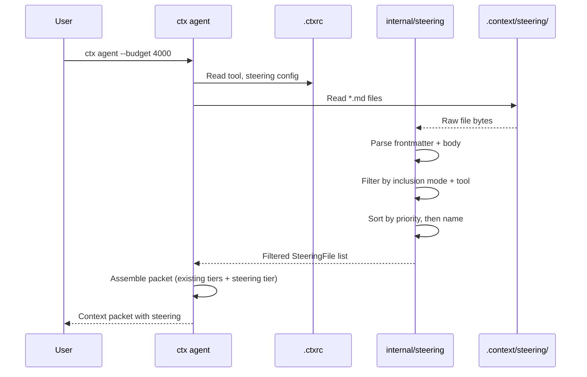
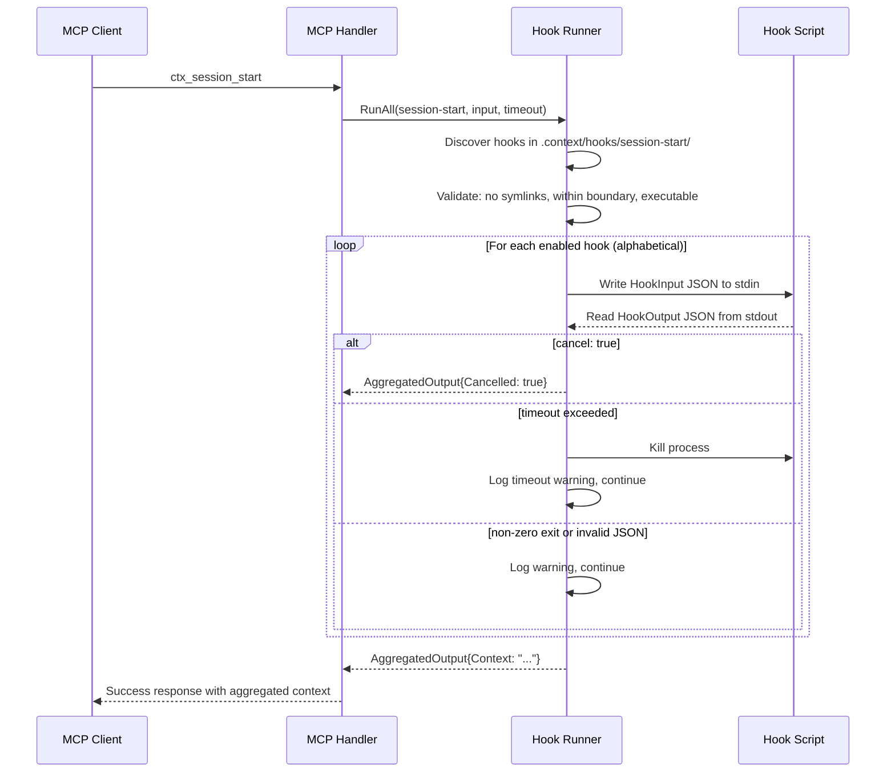

# Design Document: Hooks & Steering

## Overview

This design extends `ctx` from a persistence-only AI-context layer into a behavioral guidance and lifecycle automation platform. The system adds four major subsystems to the existing codebase:

1. **Steering Layer** — Markdown files with YAML frontmatter in `.context/steering/` that define persistent behavioral rules. These are injected into AI prompts via `ctx agent`, synced to tool-native formats (Cursor `.mdc`, Cline `.md`, Kiro `.md`), and exposed via MCP.

2. **Hooks System** — Executable scripts in `.context/hooks/<hook-type>/` that fire at lifecycle events (`pre-tool-use`, `post-tool-use`, `session-start`, `session-end`, `file-save`, `context-add`). Scripts receive JSON via stdin and return JSON via stdout, enabling blocking, context injection, and automation.

3. **MCP Server Extensions** — New MCP tools (`ctx_steering_get`, `ctx_search`, `ctx_session_start`, `ctx_session_end`) that expose steering retrieval, context search, and session lifecycle to any MCP-compatible AI tool.

4. **Skills System** — Reusable instruction bundles in `.context/skills/<name>/SKILL.md` that can be installed, listed, removed, and activated via `ctx agent --skill <name>`.

All subsystems are additive — existing workflows (`ctx agent`, `ctx drift`, `CLAUDE.md`/`AGENTS.md` generation) continue unchanged when the new directories don't exist. The active AI tool is set once via the `tool` field in `.ctxrc`; a `--tool` CLI flag overrides it per-command. Cross-tool configuration switching reuses the existing `ctx config switch` profile mechanism (`.ctxrc.kiro`, `.ctxrc.claude`, etc.).

### Design Principles

- **File-based**: All artifacts are plain files (markdown, YAML, shell scripts) — git-versionable, human-readable.
- **Tool-agnostic**: Works with Claude Code, Cursor, Cline, Kiro, Codex via the `tool` field.
- **Additive**: Each subsystem is independently useful; nothing breaks existing usage.
- **ctx is source of truth**: Other tools sync *from* ctx, not the reverse.
- **Zero lock-in**: Standard formats throughout — no proprietary encoding.
- **Consistent patterns**: New packages follow existing `internal/cli/<cmd>/{cmd,core}/` and `internal/<domain>/` conventions.

## Architecture

### High-Level Component Diagram



### Package Layout

New packages follow the existing convention of `internal/cli/<command>/` for CLI wiring and `internal/<domain>/` for domain logic:

```
internal/
├── steering/              # NEW — Steering domain logic
│   ├── doc.go
│   ├── parse.go           # Frontmatter parser (parse/print round-trip)
│   ├── parse_test.go
│   ├── filter.go          # Inclusion mode filtering
│   ├── filter_test.go
│   ├── sync.go            # Tool-native format sync
│   ├── sync_test.go
│   └── types.go           # SteeringFile, InclusionMode types
├── hook/                  # NEW — Hook domain logic
│   ├── doc.go
│   ├── discover.go        # Hook discovery and validation
│   ├── discover_test.go
│   ├── runner.go          # Hook execution (stdin/stdout JSON)
│   ├── runner_test.go
│   ├── security.go        # Symlink/boundary checks
│   ├── security_test.go
│   └── types.go           # HookInput, HookOutput, HookType types
├── skill/                 # NEW — Skill domain logic
│   ├── doc.go
│   ├── install.go
│   ├── load.go
│   ├── remove.go
│   └── types.go
├── cli/
│   ├── steering/          # NEW — ctx steering CLI
│   │   ├── steering.go
│   │   ├── doc.go
│   │   └── cmd/
│   │       ├── add.go
│   │       ├── list.go
│   │       ├── preview.go
│   │       ├── init.go
│   │       └── sync.go
│   ├── hook/              # NEW — ctx hook CLI
│   │   ├── hook.go
│   │   ├── doc.go
│   │   └── cmd/
│   │       ├── add.go
│   │       ├── list.go
│   │       ├── test.go
│   │       ├── enable.go
│   │       └── disable.go
│   └── skill/             # NEW — ctx skill CLI
│       ├── skill.go
│       ├── doc.go
│       └── cmd/
│           ├── install.go
│           ├── list.go
│           └── remove.go
└── ...existing packages unchanged...
```


## Components and Interfaces

### 1. Steering Package (`internal/steering/`)

#### Types (`types.go`)

```go
// InclusionMode determines when a steering file is injected.
type InclusionMode string

const (
    InclusionAlways InclusionMode = "always"
    InclusionAuto   InclusionMode = "auto"
    InclusionManual InclusionMode = "manual"
)

// SteeringFile represents a parsed steering file.
type SteeringFile struct {
    Name        string        // from frontmatter
    Description string        // from frontmatter
    Inclusion   InclusionMode // default: manual
    Tools       []string      // default: all tools
    Priority    int           // default: 50
    Body        string        // markdown content after frontmatter
    Path        string        // filesystem path
}
```

#### Parser (`parse.go`)

```go
// Parse reads a steering file from bytes, extracting YAML frontmatter
// and markdown body. Returns an error if frontmatter is invalid YAML.
func Parse(data []byte, filePath string) (*SteeringFile, error)

// Print serializes a SteeringFile back to frontmatter + markdown bytes.
// Round-trip property: Parse(Print(Parse(data))) == Parse(data).
func Print(sf *SteeringFile) []byte
```

The parser uses `gopkg.in/yaml.v3` (already a dependency) for frontmatter. Frontmatter is delimited by `---` lines. Fields not present in frontmatter get defaults: `inclusion` → `"manual"`, `tools` → `nil` (meaning all tools), `priority` → `50`.

#### Filter (`filter.go`)

```go
// LoadAll reads all .md files from the steering directory and parses them.
func LoadAll(steeringDir string) ([]*SteeringFile, error)

// Filter returns steering files applicable for the given context:
// - always: included unconditionally
// - auto: included when prompt matches description (substring match)
// - manual: included only when explicitly named
// Results are sorted by ascending priority, then alphabetically by name.
func Filter(files []*SteeringFile, prompt string, manualNames []string, tool string) []*SteeringFile
```

The `tool` parameter filters out steering files whose `Tools` list excludes the given tool. When `Tools` is empty/nil, the file applies to all tools.

#### Sync (`sync.go`)

```go
// SyncTool writes steering files to the tool-native format directory.
// Skips files whose tools list excludes the target tool.
// Skips files whose content hasn't changed (idempotent).
func SyncTool(steeringDir, projectRoot, tool string) (SyncReport, error)

// SyncAll syncs to all supported tool formats.
func SyncAll(steeringDir, projectRoot string) (SyncReport, error)

// SyncReport summarizes what was written, skipped, or errored.
type SyncReport struct {
    Written []string
    Skipped []string
    Errors  []error
}
```

Tool-native format mapping:
| Tool | Output Directory | Format |
|------|-----------------|--------|
| `cursor` | `.cursor/rules/<name>.mdc` | Cursor MDC frontmatter + markdown |
| `cline` | `.clinerules/<name>.md` | Plain markdown (no frontmatter) |
| `kiro` | `.kiro/steering/<name>.md` | Kiro frontmatter + markdown |
| `claude` | N/A (uses `ctx agent` directly) | — |
| `codex` | N/A (uses `ctx agent` directly) | — |

### 2. Hook Package (`internal/hook/`)

#### Types (`types.go`)

```go
// HookType represents a lifecycle event category.
type HookType string

const (
    PreToolUse  HookType = "pre-tool-use"
    PostToolUse HookType = "post-tool-use"
    SessionStart HookType = "session-start"
    SessionEnd   HookType = "session-end"
    FileSave     HookType = "file-save"
    ContextAdd   HookType = "context-add"
)

// ValidHookTypes returns all valid hook type strings.
func ValidHookTypes() []HookType

// HookInput is the JSON object sent to hook scripts via stdin.
type HookInput struct {
    HookType   string            `json:"hookType"`
    Tool       string            `json:"tool"`
    Parameters map[string]any    `json:"parameters"`
    Session    HookSession       `json:"session"`
    Timestamp  string            `json:"timestamp"`  // ISO 8601
    CtxVersion string            `json:"ctxVersion"`
}

type HookSession struct {
    ID    string `json:"id"`
    Model string `json:"model"`
}

// HookOutput is the JSON object returned by hook scripts via stdout.
type HookOutput struct {
    Cancel  bool   `json:"cancel"`
    Context string `json:"context,omitempty"`
    Message string `json:"message,omitempty"`
}

// HookInfo describes a discovered hook script.
type HookInfo struct {
    Name     string
    Type     HookType
    Path     string
    Enabled  bool  // true if executable bit is set
}
```

#### Discovery (`discover.go`)

```go
// Discover finds all hook scripts in the hooks directory, grouped by type.
// Skips non-executable scripts (logs warning). Skips symlinks (security).
// Returns empty map if hooks directory doesn't exist.
func Discover(hooksDir string) (map[HookType][]HookInfo, error)

// FindByName searches all hook type directories for a hook with the given name.
func FindByName(hooksDir, name string) (*HookInfo, error)
```

#### Runner (`runner.go`)

```go
// RunAll executes all enabled hooks for the given type, in alphabetical order.
// Passes input as JSON via stdin, reads output as JSON from stdout.
// If a hook returns cancel:true, stops and returns the cancellation.
// If a hook exits non-zero or returns invalid JSON, logs warning and continues.
// Enforces configurable timeout (default 10s) per hook.
func RunAll(hooksDir string, hookType HookType, input *HookInput, timeout time.Duration) (*AggregatedOutput, error)

// AggregatedOutput collects results from all hooks in a run.
type AggregatedOutput struct {
    Cancelled bool
    Message   string
    Context   string   // concatenated context from all hooks
    Errors    []string // warnings from failed hooks
}
```

#### Security (`security.go`)

```go
// ValidateHookPath checks that a hook script path:
// 1. Resolves within the hooks directory boundary
// 2. Is not a symlink
// 3. Has the executable permission bit
// Returns a descriptive error if any check fails.
func ValidateHookPath(hooksDir, hookPath string) error
```

This reuses the patterns from `internal/validate/path.go` (boundary check, symlink rejection via `os.Lstat`).

### 3. Skill Package (`internal/skill/`)

#### Types (`types.go`)

```go
// Skill represents a parsed skill manifest.
type Skill struct {
    Name        string // from SKILL.md frontmatter
    Description string // from SKILL.md frontmatter
    Body        string // markdown instruction content
    Dir         string // directory path
}
```

#### Operations

```go
// Install copies a skill from source into .context/skills/<name>/.
// Validates that source contains a valid SKILL.md with frontmatter.
func Install(source, skillsDir string) (*Skill, error)

// LoadAll reads all installed skills from the skills directory.
func LoadAll(skillsDir string) ([]*Skill, error)

// Load reads a single skill by name.
func Load(skillsDir, name string) (*Skill, error)

// Remove deletes a skill directory.
func Remove(skillsDir, name string) error
```

### 4. RC Package Extensions (`internal/rc/`)

New fields added to `CtxRC`:

```go
// Added to existing CtxRC struct:
Tool     string         `yaml:"tool"`      // Tool_Identifier: claude, cursor, cline, kiro, codex
Steering *SteeringRC    `yaml:"steering"`
Hooks    *HooksRC       `yaml:"hooks"`

type SteeringRC struct {
    Dir              string   `yaml:"dir"`               // default: .context/steering
    DefaultInclusion string   `yaml:"default_inclusion"`  // default: manual
    DefaultTools     []string `yaml:"default_tools"`      // default: all
}

type HooksRC struct {
    Dir     string `yaml:"dir"`     // default: .context/hooks
    Timeout int    `yaml:"timeout"` // seconds, default: 10
    Enabled *bool  `yaml:"enabled"` // default: true
}
```

New accessor functions:

```go
func Tool() string           // returns RC().Tool
func SteeringDir() string    // returns RC().Steering.Dir or default
func HooksDir() string       // returns RC().Hooks.Dir or default
func HookTimeout() int       // returns RC().Hooks.Timeout or 10
func HooksEnabled() bool     // returns RC().Hooks.Enabled or true
```

The existing priority hierarchy is preserved: CLI flags > environment variables > `.ctxrc` > hardcoded defaults.

### 5. MCP Handler Extensions (`internal/mcp/handler/`)

New methods on the existing `Handler` struct:

```go
// SteeringGet returns applicable steering files for the given prompt.
// If prompt is empty, returns only "always" inclusion files.
func (h *Handler) SteeringGet(prompt string) (string, error)

// Search searches across all .context/ files for the given query.
// Returns matching excerpts with file paths and line numbers.
func (h *Handler) Search(query string) (string, error)

// SessionStartHooks executes session-start hooks and returns aggregated context.
func (h *Handler) SessionStartHooks() (string, error)

// SessionEndHooks executes session-end hooks with the given summary.
func (h *Handler) SessionEndHooks(summary string) (string, error)
```

New MCP tool definitions registered in `internal/mcp/server/catalog/`:
- `ctx_steering_get` — parameters: `prompt` (optional string)
- `ctx_search` — parameters: `query` (required string)
- `ctx_session_start` — no parameters
- `ctx_session_end` — parameters: `summary` (optional string)

### 6. Drift Detection Extensions (`internal/drift/`)

New check types and issue types:

```go
// New IssueTypes:
IssueInvalidTool    IssueType = "invalid_tool"       // unsupported tool identifier
IssueHookNoExec     IssueType = "hook_no_exec"        // hook missing executable bit
IssueStaleSyncFile  IssueType = "stale_sync_file"     // synced file out of date

// New CheckNames:
CheckSteeringTools  CheckName = "steering_tools"      // validate tool identifiers
CheckHookPerms      CheckName = "hook_permissions"     // check executable bits
CheckSyncStaleness  CheckName = "sync_staleness"       // compare synced vs source
CheckRCTool         CheckName = "rc_tool_field"        // validate .ctxrc tool field
```

### 7. Init Command Extensions (`internal/cli/initialize/`)

The existing `ctx init` command is extended to create three additional directories:
- `.context/steering/`
- `.context/hooks/`
- `.context/skills/`

All directories are created with `0755` permissions. Existing directories are silently skipped.

### 8. Agent Command Extensions (`internal/cli/agent/`)

The `AssemblePacket` function is extended with a new tier for steering files, inserted after existing tiers:

```
Tier 1: Constitution, read order, instruction (always)
Tier 2: Active tasks (40%)
Tier 3: Conventions (20%)
Tier 4+5: Decisions + Learnings (remaining)
NEW Tier 6: Steering files (from remaining budget after Tier 4+5)
NEW Tier 7: Skill content (--skill flag, from remaining budget)
```

Steering files with `inclusion: always` are included unconditionally. Files with `inclusion: auto` are included when the prompt context matches. The `--skill <name>` flag adds the named skill's content to the packet.

### 9. Bootstrap Registration (`internal/bootstrap/`)

New command groups and registrations:

```go
// New commands registered in bootstrap:
// Group: Integration
//   - ctx steering (subcommands: add, list, preview, init, sync)
//   - ctx hook (subcommands: add, list, test, enable, disable)
//   - ctx skill (subcommands: install, list, remove)
```

### 10. CLI Flag: `--tool`

A persistent flag `--tool` is added to the root command. When provided, it overrides the `tool` field from `.ctxrc`. Commands that need a tool identifier read it via a helper:

```go
// ResolveTool returns the active tool identifier from --tool flag or .ctxrc.
// Returns an error if neither is set and the command requires a tool.
func ResolveTool(cmd *cobra.Command) (string, error)
```


## Data Models

### Steering File On-Disk Format

```yaml
---
name: api-standards
description: REST API design conventions. Apply when creating or modifying endpoints.
inclusion: auto
tools: [claude, cursor, cline, codex]
priority: 50
---

# API Standards
- Use RESTful conventions (nouns, not verbs)
- Always return JSON with { data, error, meta }
- Version all endpoints: /api/v1/...
```

**Frontmatter fields:**

| Field | Type | Default | Description |
|-------|------|---------|-------------|
| `name` | string | required | Unique identifier for the steering file |
| `description` | string | `""` | Used for `auto` inclusion matching |
| `inclusion` | enum | `"manual"` | One of: `always`, `auto`, `manual` |
| `tools` | []string | `[]` (all) | Which tools receive this file |
| `priority` | int | `50` | Lower = injected first |

### Hook Input JSON Schema

```json
{
  "hookType": "pre-tool-use",
  "tool": "write_file",
  "parameters": { "path": "src/api/users.go", "content": "..." },
  "session": { "id": "sess_abc123", "model": "claude-sonnet-4-6" },
  "timestamp": "2026-03-22T10:30:00Z",
  "ctxVersion": "0.9.0"
}
```

### Hook Output JSON Schema

```json
{
  "cancel": false,
  "context": "Additional text injected into AI conversation",
  "message": "Optional user-visible message"
}
```

### Skill Manifest (`SKILL.md`)

```yaml
---
name: react-patterns
description: React component patterns. Activate when creating or modifying React components.
---

# React Patterns
- Use functional components with hooks
- Co-locate tests with components
```

### Extended `.ctxrc` Format

```yaml
profile: kiro
tool: kiro

steering:
  dir: .context/steering
  default_inclusion: manual
  default_tools: [kiro, claude]

hooks:
  dir: .context/hooks
  timeout: 10
  enabled: true

token_budget: 8000
```

### Tool-Native Format Mapping

**Cursor (`.cursor/rules/<name>.mdc`):**
```yaml
---
description: <steering description>
globs: []
alwaysApply: <true if inclusion=always, false otherwise>
---
<steering body>
```

**Cline (`.clinerules/<name>.md`):**
```markdown
# <steering name>

<steering body>
```

**Kiro (`.kiro/steering/<name>.md`):**
```yaml
---
name: <steering name>
description: <steering description>
mode: <always|auto|manual mapped to Kiro equivalents>
---
<steering body>
```

### Supported Tool Identifiers

| Identifier | Tool | Sync Support |
|-----------|------|-------------|
| `claude` | Claude Code | No sync (uses `ctx agent` directly) |
| `cursor` | Cursor | `.cursor/rules/*.mdc` |
| `cline` | Cline | `.clinerules/*.md` |
| `kiro` | Kiro | `.kiro/steering/*.md` |
| `codex` | OpenAI Codex | No sync (uses `ctx agent` directly) |

### Hook Script Template

Generated by `ctx hook add <type> <name>`:

```bash
#!/usr/bin/env bash
# Hook: <name>
# Type: <hook-type>
# Created by: ctx hook add

set -euo pipefail

INPUT=$(cat)

# Parse input fields
HOOK_TYPE=$(echo "$INPUT" | jq -r '.hookType')
TOOL=$(echo "$INPUT" | jq -r '.tool // empty')

# Your hook logic here

# Return output
echo '{"cancel": false, "context": "", "message": ""}'
```

### Directory Structure After Init

```
.context/
├── TASKS.md              (existing)
├── DECISIONS.md          (existing)
├── LEARNINGS.md          (existing)
├── CONVENTIONS.md        (existing)
├── ARCHITECTURE.md       (existing)
├── CONSTITUTION.md       (existing)
├── GLOSSARY.md           (existing)
├── steering/             (NEW)
│   ├── product.md        (created by ctx steering init)
│   ├── tech.md           (created by ctx steering init)
│   ├── structure.md      (created by ctx steering init)
│   └── workflow.md       (created by ctx steering init)
├── hooks/                (NEW, empty after ctx init)
│   ├── pre-tool-use/
│   ├── post-tool-use/
│   ├── session-start/
│   ├── session-end/
│   ├── file-save/
│   └── context-add/
└── skills/               (NEW, empty after ctx init)
```

### Data Flow: Steering Inclusion



### Data Flow: Hook Execution


