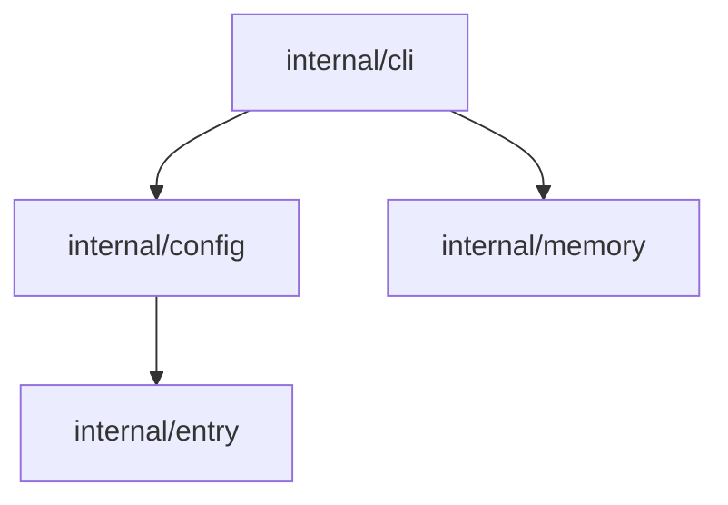

## Why Dependency Graphs?

Understanding how packages relate to each other is the first step in
onboarding, refactoring, and architecture review. `ctx dep` generates
dependency graphs from source code so you can see the structure at a
glance instead of tracing imports by hand.

## Quick Start

```bash
# Auto-detect ecosystem and output Mermaid (default)
ctx dep

# Table format for a quick terminal overview
ctx dep --format table

# JSON for programmatic consumption
ctx dep --format json
```

## Ecosystem Detection

`ctx dep` looks for manifest files in this order:

1. **Go**: `go.mod`
2. **Node.js**: `package.json`
3. **Python**: `pyproject.toml`, `setup.py`, `requirements.txt`
4. **Rust**: `Cargo.toml`

First match wins. To override detection, use `--type`:

```bash
# Force Python even if go.mod exists
ctx dep --type python
```

## Output Formats

### Mermaid (default)

Produces a Mermaid graph definition you can paste into GitHub PRs,
Obsidian notes, or any Mermaid-compatible renderer.

```bash
ctx dep --format mermaid
```



### Table

Flat two-column view for quick terminal scanning.

```bash
ctx dep --format table
```

```
PACKAGE                  DEPENDS ON
internal/cli             internal/config, internal/memory
internal/config          internal/entry
internal/memory          internal/index
```

### JSON

Machine-readable output for scripts and pipelines.

```bash
ctx dep --format json | jq '.nodes | length'
```

## Including External Dependencies

By default, only internal (first-party) dependencies are shown. Add
`--external` to include third-party packages:

```bash
ctx dep --external
ctx dep --external --format table
```

This is useful when auditing transitive dependencies or checking which
packages pull in heavy external libraries.

## When to Use It

- **Onboarding.** Generate a Mermaid graph and drop it into the project
  wiki. New contributors see the architecture before reading code.
- **Refactoring.** Before moving packages, check what depends on them.
  Combine with `ctx drift` to find stale references after the move.
- **Architecture review.** Table format gives a quick overview; Mermaid
  format goes into design docs and PRs.
- **Pre-commit.** Run in CI to detect unexpected new dependencies
  between packages.

## Combining with Other Commands

### Refactoring with ctx drift

```bash
# See the dependency structure before refactoring
ctx dep --format table

# After moving packages, check for broken references
ctx drift
```

### Feeding architecture maps

Use JSON output as input for context files or architecture documentation:

```bash
# Generate a dependency snapshot for the context directory
ctx dep --format json > .context/deps.json

# Or pipe into other tools
ctx dep --format mermaid >> docs/architecture.md
```

## Monorepos and Multi-Ecosystem Projects

In a monorepo with multiple ecosystems, `ctx dep` picks the first
manifest it finds (Go beats Node.js beats Python beats Rust). Use
`--type` to target a specific ecosystem:

```bash
# In a repo with both go.mod and package.json
ctx dep --type node
ctx dep --type go
```

For separate subdirectories, run from each root:

```bash
cd services/api && ctx dep --format table
cd frontend && ctx dep --type node --format mermaid
```

## Tips

- **Start with table format.** It is the fastest way to get a mental
  model of the dependency structure. Switch to Mermaid when you need
  a visual for documentation or a PR.
- **Pipe JSON to jq.** Filter for specific packages, count edges, or
  extract subgraphs programmatically.
- **Skip `--external` unless you need it.** Internal-only graphs are
  cleaner and load faster. Add external deps when you are specifically
  auditing third-party usage.
- **Force `--type` in CI.** Auto-detection is convenient locally, but
  explicit types prevent surprises when the repo structure changes.
